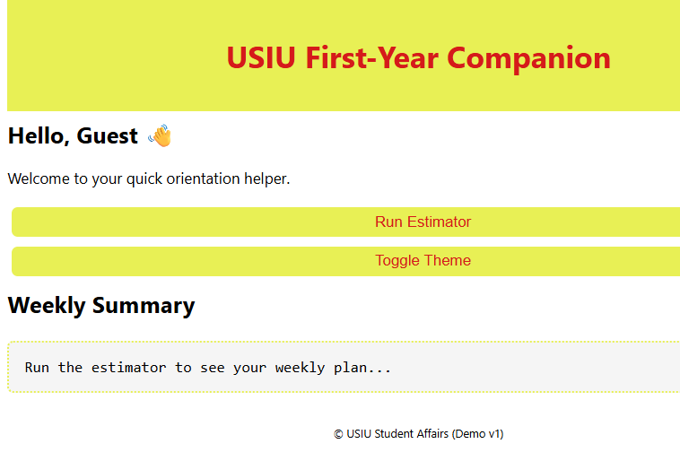
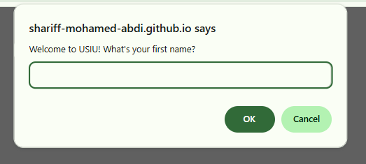
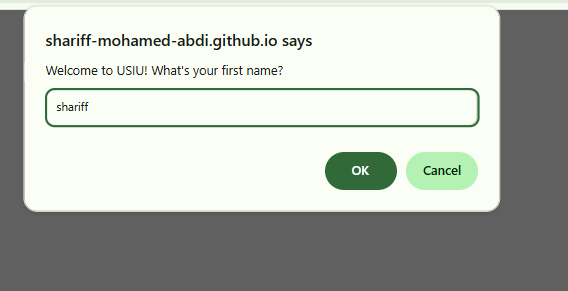
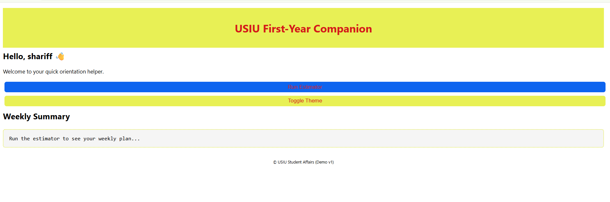
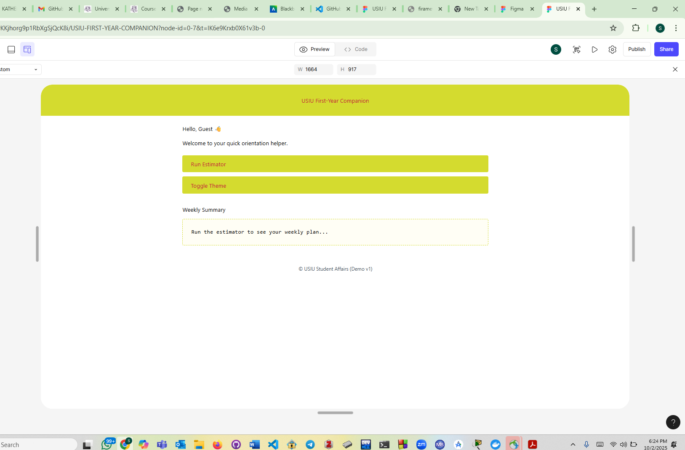

# USIU First-Year Companion (v1)

This is the first version of the **USIU First-Year Companion**, created as part of a practical assignment. It is a lightweight, static microsite designed to help new students during their orientation week at **USIU** (United States International University Africa). The project includes a simple campus cost/commute estimator, personalized greeting, and a theme toggle feature (day/night mode).


## Project Description

The **USIU First-Year Companion** microsite was built using **vanilla JavaScript**, **HTML5**, and **CSS**. This project is aimed at providing an easy-to-use, personalized experience for first-year students at USIU by:

1. Displaying a personalized greeting.
2. Offering a campus cost/commute estimator to help students plan their weekly expenses for transport and snacks.
3. Providing a day/night theme toggle to switch between light and dark modes.

This version does not use external libraries and works as a static site, hosted on **GitHub Pages**.

## Features

* **Personalized Greeting**: The site asks for the student’s name and displays a personalized welcome message.
* **Campus Cost/Commute Estimator**: This feature asks the user for input (number of days on campus, transport cost, snack cost) and estimates weekly transport and snack expenses, along with a potential 10% savings.
* **Theme Toggle**: A simple button allows users to toggle between light and dark themes, adjusting the background and text color.

## Installation

To run the project locally, follow these steps:

1. **Clone the repository**:

   ```bash
   git clone https://github.com/SHARIFF-MOHAMED-ABDI/practical-assignment-1.git
   ```

2. **Navigate to the project folder**:

   ```bash
   cd practical-assignment-1
   ```

3. **Open `index.html` in your browser**:

   * You can simply double-click the `index.html` file, or open it using any code editor (e.g., VS Code), and view it in your browser.

Alternatively, you can run it via a local server if you prefer.

## How to Use

1. Open the project in your browser.

2. Upon loading the page, you’ll be prompted to enter your name for a personalized greeting.

3. You can then use the **Campus Cost/Commute Estimator** by clicking the **"Run Estimator"** button, which will ask for:

   * Number of days per week you attend campus.
   * The transport cost per trip.
   * The number of snacks per day and their cost.
   * An optional “save 10%” tip will be applied to suggest possible savings.

4. The **theme toggle** button allows you to switch between day and night modes to adjust the background and text colors.

## Project Structure

```plaintext
usiu-first-year-companion/
├── design/
│   ├── wireframe-home.png
│   ├── wireframe-estimator.png
│   └── notes.md
├── public/
│   ├── index.html
│   ├── styles.css
│   └── script.js
├── Dockerfile
├── .dockerignore
└── README.md
```

### Files:

* **index.html**: Main HTML file that structures the page.
* **styles.css**: Contains the styling for the page.
* **script.js**: Contains JavaScript that handles the logic for the personalized greeting, estimator, and theme toggle.

## Deployment

This project is hosted on **GitHub Pages**. You can access the live version of the site at:

[https://SHARIFF-MOHAMED-ABDI.github.io/practical-assignment-1/](https://SHARIFF-MOHAMED-ABDI.github.io/practical-assignment-1/)

To deploy the project to your own GitHub Pages, follow these steps:

1. Create a new repository on GitHub.
2. Push the project files to your GitHub repository.
3. Enable **GitHub Pages** in the repository settings and set the **Source** to the `main` branch.
4. The site will be available at: `https://<your-username>.github.io/<your-repository-name>/`

## Contributors

* **Shariff Mohamed** (Project Author)

## License

This project is  not licensed under the MIT License 

---

### **Notes:**

* If you decide to add more features or make changes to the project, feel free to update this README accordingly!
* Make sure to update the **"Contributors"** section if others contribute to the project.
### **Project preview**
Project Preview

Below is a preview of the project, showcasing the clean and user-friendly interface of the USIU First-Year Companion microsite:
the project looks like this
" />
" />
" /> />
" />" />
" />" />


## figma

### Home page figma ##
The Figma design serves as the blueprint for the user interface of the USIU First-Year Companion microsite. The design showcases the planned layout, structure, and overall user experience (UX) of the site, helping visualize how the project will look and feel.

Home Page Figma Design: This represents the main landing page of the microsite, where users are greeted with a personalized message and are provided with access to the campus cost/commute estimator and theme toggle features. The Figma design ensures that the interface is clean, intuitive, and easy to navigate for first-year students.

### Key Elements in the Figma Design ###

Header: Displays the title and a welcoming message to the user.

Personalized Greeting Section: Where users enter their name for a customized experience.

Cost Estimator Section: Clearly laid out with input fields for users to calculate their weekly transport and snack costs.

Theme Toggle Button: Positioned for easy access, allowing users to switch between day and night modes for better readability.

Design Wireframes: These wireframes represent the structural layout before the final design elements were applied. They showcase how the page is organized and how users will interact with the content, providing clarity on the site’s functionality.

Home Page Wireframe: A blueprint for the home page's main elements.

Estimator Page Wireframe: This details the input fields and result sections for the campus cost/commute estimator tool.

In summary, the Figma design is an essential reference for understanding the user interface, design flow, and functionality of the microsite, ensuring that both functionality and aesthetics are well-aligned with the needs of the first-year students at USIU.
Here’s a preview of the Figma design for the Home Page, providing insight into the layout and structure behind this project.



